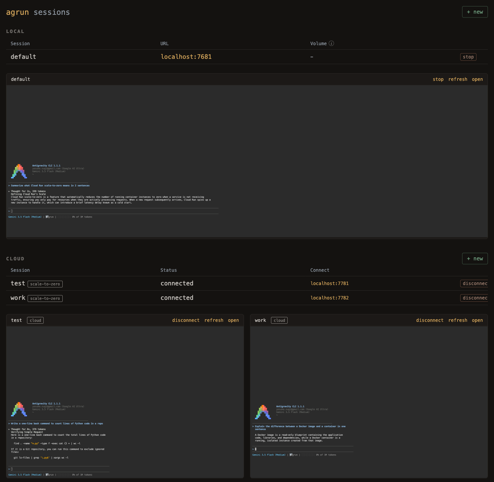

# Antigravity on Cloud Run

The easiest way to run multiple Antigravity CLI (`agy`) sessions, each in its own container, with a dashboard to manage them all. Run them locally with Docker or in the cloud on Cloud Run, from the same dashboard.



See [architecture.md](architecture.md) for design details.

## Why a container?

- **Isolated** - agy runs with bypass permissions, but can't touch your host machine.
- **Lightweight** - Spin up, stop, or delete sessions in seconds. Much faster than a full VM.
- **Portable** - Works on any machine with Docker. Same environment everywhere.
- **Cloud-ready** - The exact same container deploys to Cloud Run. Local for tinkering, cloud for sessions you can reach from anywhere.

This lets you run agy with `--dangerously-skip-permissions` safely and fast.

## One session per container

Each agy session runs in its own container. Spin up as many as you need - they're isolated from each other and start in seconds. Run different research tasks, projects, or experiments in parallel without interference. Auth and conversation history persist automatically: local sessions store them on your host machine via a volume mount, cloud sessions in a per-session Cloud Storage bucket (see [Session persistence](#session-persistence)).

## Quickstart

```bash
# Build image (once, or after changes)
./scripts/build.sh

# Start container and web terminal
./scripts/run.sh

# To mount a local project (host_path:container_path)
./scripts/run.sh -v ~/myproject:/home/agrun/myproject

# Run multiple sessions with -s
./scripts/run.sh -s work        # agrun-work on next available port
./scripts/run.sh -s research    # agrun-research on next available port

# Or deploy a session to Cloud Run instead (see the Cloud Run section)
./scripts/deploy-cloud.sh -s research
```

`run.sh` starts a web terminal at http://localhost:7681 and opens it in your browser. If you're logged into agy on the host, `run.sh` copies that login into each new session automatically - no sign-in needed. Otherwise agy shows a Google sign-in URL in the terminal on first launch; complete it once and it persists across container rebuilds.

## Dashboard

Manage all sessions from a web dashboard:

```bash
node dashboard/server.js
```

Opens at http://localhost:7680 with two sections, local and cloud:
- Create new sessions (local: volume mounts and initial queries; cloud: deploys to Cloud Run)
- All sessions listed with start/stop/delete (local) and connect/disconnect/delete (cloud) controls
- Live embedded terminals for active sessions, cloud included (via an IAM-authenticated proxy)

## What's included

- Ubuntu 24.04
- Node.js 24 (LTS)
- Antigravity CLI (`agy`)
- GitHub CLI with auto-configured git user
- Playwright MCP with Chromium (preconfigured for agy)
- Custom status line ([context bar](https://github.com/ykdojo/antigravity-cli-tips#tip-1-set-up-your-custom-status-line)), [shell aliases](#aliases)
- ttyd web terminal + tmux

## Sensible defaults

- `--dangerously-skip-permissions` enabled (because it's containerized)
- Playwright MCP preconfigured in `~/.gemini/config/mcp_config.json`
- Baked-in `AGENTS.md` with container-aware instructions

Note: the agy installer has no version pinning and the binary self-updates in the background.

## Session persistence

Each session's data persists locally at:

```
~/.config/agrun/sessions/<session-name>/
```

This maps to `/home/agrun/.gemini/` inside the container and includes:
- **Auth** - Google sign-in credentials (copied from the host, or from a one-time sign-in)
- **Conversations** - agy conversation history
- **Settings** - `antigravity-cli/settings.json`, MCP config, statusline

Rebuilding containers or restarting sessions won't affect any of these.

Cloud sessions persist the same data to a per-session Cloud Storage bucket instead (see [Cloud Run](#cloud-run)).

## Authentication

agy reuses your host login: `run.sh` copies `~/.gemini/antigravity-cli/antigravity-oauth-token` from the host into each new session (never overwriting a session's own token, since agy refreshes it). No host login? agy falls back to an interactive Google sign-in in the web terminal, done once per session.

Other tokens are stored in `~/.config/agrun/.secrets/` and injected as env vars on each run. The filename becomes the env var name.

| File | How to generate |
|------|-----------------|
| `GH_TOKEN` | `gh auth token` or create a PAT at github.com/settings/tokens |

You can add any additional secrets by creating files in the `.secrets/` directory.

## Scripts

| Script | Description |
|--------|-------------|
| `scripts/build.sh` | Build the Docker image and remove old container |
| `scripts/run.sh` | Start/reuse container, inject auth, start ttyd. Use `-s name` for named sessions, `-v` for volumes, `-n` to skip opening browser, `-q "question"` to start with a query. |
| `scripts/deploy-cloud.sh` | Deploy a session to Cloud Run (scale-to-zero by default). `-s name` for the session, `-a` for always-on, `-P`/`-r` for project/region. |
| `scripts/manage-env.js` | Manage environment variables (list, add, delete) |
| `dashboard/server.js` | Web dashboard for managing multiple sessions |

## Aliases

Inside each container, these aliases are available:

| Alias | Command |
|-------|---------|
| `a` | `agy` |
| `ad` | `agy --dangerously-skip-permissions` |

## npm scripts

| Command | Runs |
|---------|------|
| `npm run build` | `./scripts/build.sh` |
| `npm start` | `./scripts/run.sh` |
| `npm run dashboard` | `node dashboard/server.js` |
| `npm run dashboard:dev` | `nodemon dashboard/server.js` |
| `npm run manage-env` | `node scripts/manage-env.js` |

## Cloud Run

Deploy a session to Cloud Run (one service per session):

```bash
./scripts/deploy-cloud.sh -s research      # scales to zero when idle (default)
./scripts/deploy-cloud.sh -s work -a       # always-on (a warm instance 24/7 - costs real money)
```

The script pushes the image to Artifact Registry, stores your agy login in Secret Manager, creates a GCS bucket per session (session state is continuously backed up to it), and deploys IAM-gated. Connect from the dashboard's cloud section, or manually with:

```bash
gcloud run services proxy agrun-work --region us-central1 --port 7681
```

Never deploy with `--allow-unauthenticated` - the web terminal is a remote shell. Scale-to-zero sessions lose the live terminal on idle, but conversations resume with `agy -c` from the session's GCS backup.

## Roadmap

- Skills (in `setup/skills/`, not wired up for agy yet)
