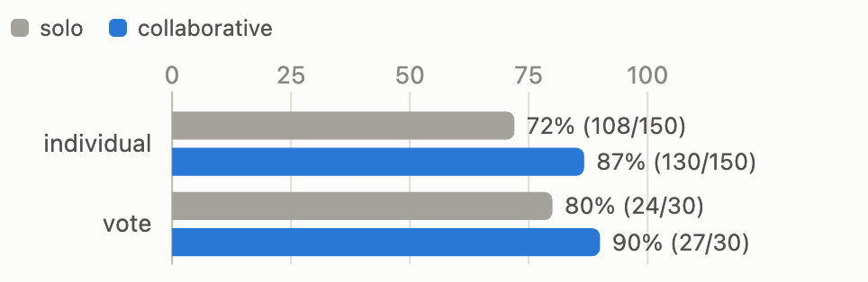
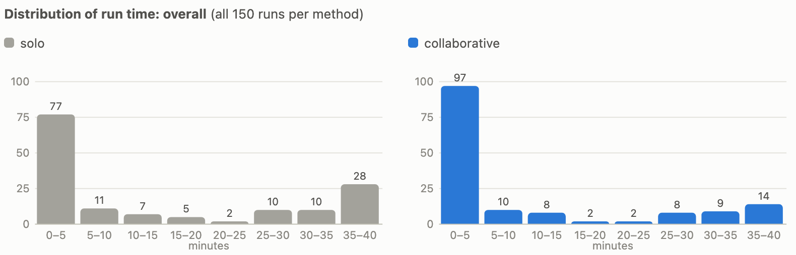
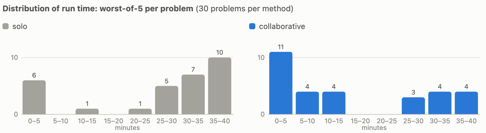

# For coding agents, real-time collaboration beats the "wisdom of the crowd"

**tl;dr:** I ran AI coding agents on 30 [Project Euler](https://projecteuler.net/) problems in two ways: five
agents working separately, and five agents collaborating in real time. For
both, I also computed the majority vote across the five answers at the end.
The collaborating agents beat both the separate agents and their majority
vote. Average accuracy without the vote went from 72% to 87%.

## The setup

I had AI coding agents, specifically Gemini 3.5 Flash running through
Antigravity, tackle 30 math and programming problems from Project Euler: all problems
published this year except one ([983](https://projecteuler.net/problem=983)),
whose answer I could not verify on the website.

For each problem, five agents ran in
[five concurrent containers](https://github.com/ykdojo/antigravity-cloud-run).
I ran them in two ways:

1. **Solo:** no ability to communicate with each other as they solved the
   problem.
2. **Collaborative:** extra prompts letting them know they can collaborate,
   and an MCP server that lets any agent broadcast a message to the rest,
   kind of like sending each other emails.

In both cases I also took the majority vote across the five answers at the
end. So in total there are four methods to compare: solo individuals, solo
with vote, collaborative individuals, and collaborative with vote.

Each agent had 30 minutes of working time, plus up to 10 extra minutes to wrap
up and submit a final answer, so a single run can take up to about 40 minutes.

## The results

Individually, solo agents got 108 of 150 runs correct (72%). With real-time
collaboration, the same setup got 130 of 150 (87%). The majority vote went from
24 of 30 problems (80%) to 27 of 30 (90%). As you can see, both real-time
collaboration and the "wisdom of the crowd", aka majority voting, are
effective, but real-time collaboration had a stronger effect on the overall
accuracy.

|  | solo | collaborative |
|---|---|---|
| average run time | 14m | 10m |
| median worst-of-5 time | 31m | 11m |

The worst-of-5 time is relevant because if you wait for all five answers,
that is when you get the final answer through the vote. The average time is relevant in a different
way: it is a proxy for measuring the tokens and compute you use. Antigravity
unfortunately does not give you exact token counts, but tokens and compute
scale with the time it takes to solve a problem.

More collaborative runs end inside the first five minutes (97 vs 77), and
fewer of them run past the 30 minute mark (23 vs 38).

On worst-of-5 time, solo sets pile up at the 30 to 40 minute end because
many problems left at least one agent running until the cap. Collaborative sets most often finish
within the first five minutes because once one agent solves the problem and
shares its findings, the rest can finish quickly too, though the harder ones still
run long.

Three individual problems are worth calling out:

- **The rescue.** On [problem 989](https://projecteuler.net/problem=989), solo
  agents went 0 for 5, and two of them submitted confident wrong answers. In
  the collaborative run, one agent shared a verified characterization of the
  problem's structure at minute 5, two others confirmed intermediate values
  against an example given in the problem statement, and all five agents
  converged on the
  correct answer, unanimously. Collaboration solved a problem that no individual
  agent solved in any run.
- **The speedup.** On [problem 993](https://projecteuler.net/problem=993),
  solo went 3 of 5 with one agent falling into a subtle extrapolation trap.
  The collaborative run went 5 of 5, about 4 times faster.
- **The failure.** On [problem 1006](https://projecteuler.net/problem=1006),
  nobody solved it in either setup. But in the collaborative run, a correctly
  verified *intermediate* value circulated between agents, and two of them
  submitted it as the final answer.

## Disclaimers

These agents are not deterministic. If you try to reproduce the results you
might get slightly different numbers, but in principle you should be able to
get similar results.

Per Project Euler's rules, no numeric answers are published here or in the
repo. Runs were scored against privately held answers that were verified on
the site itself.

## Open questions

The insights here were drawn from experiments with only 5 agents, so there are
still many unknowns.

- What about 25 agents, 50, 100? Does it scale to solving harder and harder
  problems?
- With 100 agents, is it better to have one big group chat, or ten separate
  group chats of ten, with some way to communicate between the groups as well?
- Does it work as well with other models?
- Does it work with other harnesses?
- Is it better to let them collaborate freely as we did here, or assign them
  specific roles?

A lot of open questions, but I believe this is a decent start.

## Prior art

One of the closest things currently in production is xAI's Grok Heavy line: Grok 4 Heavy ran
multiple agents in parallel that compare notes like a study group, and the
newer versions make a multi-agent setup the default for complex queries.

## Appendix

The exact prompts, the Dockerfile, and the full per-run outcome data (correct
or not, and time taken, for all 300 runs) are in the
[appendix](appendix.md).
