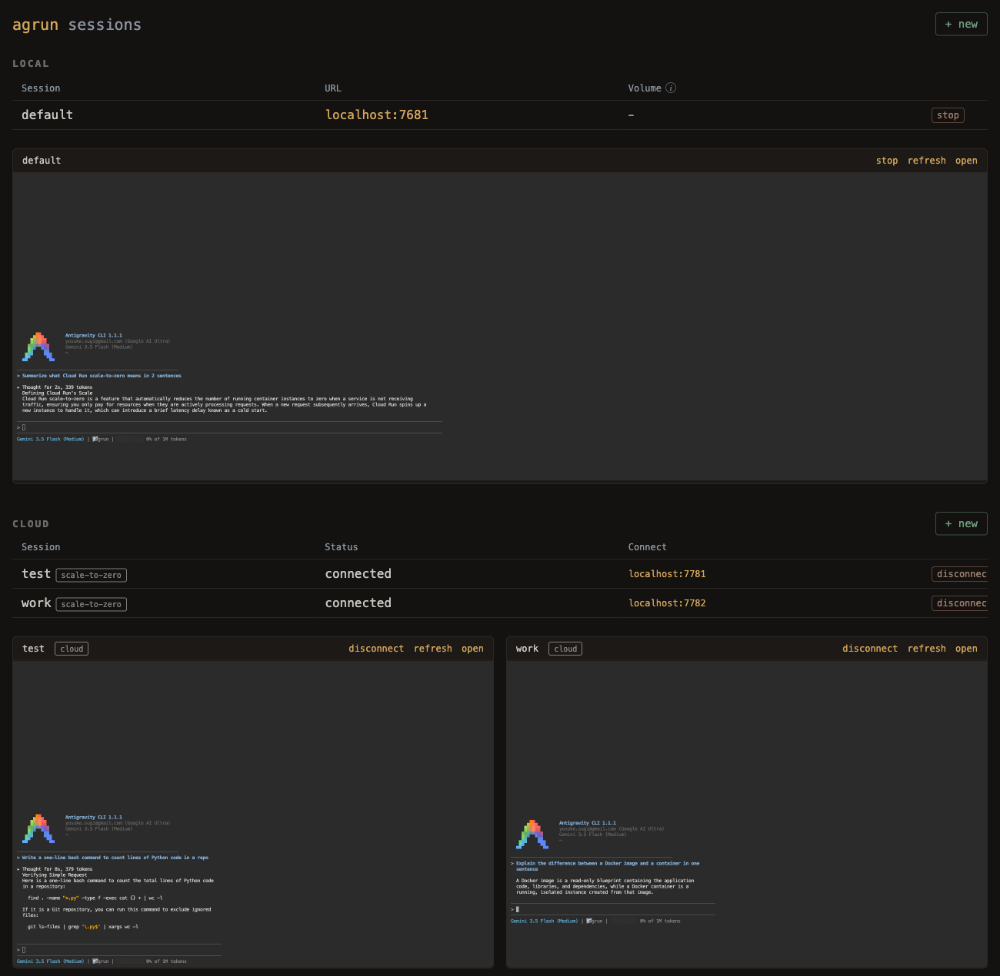

# How to spin up dev environments for your AI coding agents in the cloud

**tl;dr:** I gave each AI coding agent, Google's
[Antigravity CLI](https://antigravity.google/) in my case, its own container,
so it can run with permissions switched off without ever touching my machine.
The same image runs locally under Docker and in the cloud on Cloud Run, managed
from one dashboard. Everything here is in
[this repo](https://github.com/ykdojo/antigravity-cloud-run).

## Permission fatigue

Coding agents ask before they act, and the prompts stop protecting you the
moment you are numb to them. Lydia from Anthropic
[put it well](https://www.youtube.com/watch?v=6ERUGFurDHY&t=1444s) on Google
Cloud Tech, in an episode I was also on:

> If Claude asks you questions every time, you won't read them as much
> anymore, because you're kind of, "you've asked me 100 times now, sure, just
> go ahead." That's permission fatigue, which is also dangerous.

She names the other end of the tradeoff too: skip permissions entirely and
"if it's about to delete your root file, there's no going back."

The fix is not to read the prompts more carefully. It is to make approval
unnecessary by giving the agent somewhere it cannot do damage. A second
computer works. A container is the same idea without buying hardware: escaping
one is genuinely hard, and everything the agent touches stays inside it. You
choose what goes in, including a separate GitHub account, and then you let it
run with `--dangerously-skip-permissions`.

## The setup

One agent per container, one conversation per agent. Nothing is shared, so
several can run at once without interfering. That is how I ran
[the collaboration experiment](../experiments/collaboration-vs-wisdom-of-the-crowd/)
with five agents in parallel.

Each session is a web terminal (ttyd plus tmux), so you can open it in a
browser tab or watch it live in the dashboard above.

State is per session and survives restarts. Locally it lives in a volume
mount; in the cloud, in a Cloud Storage bucket that syncs every 60 seconds and
again on shutdown. Restart a session and its conversation history is still
there.

Secrets live in one folder on my machine, one file per variable. Local
sessions get them as environment variables, and deploys push them to Secret
Manager and wire them into the service. The cloud mirrors that folder,
deletions included, so removing a key locally removes it from the cloud on the
next deploy. The caveat is that with two machines you should deploy from the
one holding the keys you want live.

## Why the cloud, and not just local containers

Local containers are already enough to be safe. The cloud buys separation: it
is a different machine, so nothing an agent does competes with your editor, and
a long job keeps running with your laptop closed. Sessions scale to zero when
idle, so for a job that must outlive your session, deploy it always-on.

Nothing is exposed publicly. Cloud sessions are IAM-gated and reached through
`gcloud run services proxy`, which tunnels the web terminal to a local port.

## Reaching other ports

Cloud Run gives a service exactly one port, so a dev server started inside a
session is invisible from outside. Instead of poking holes, each session joins
my private Tailscale network as an inbound-only node. A server on port 3000 is
then reachable at `http://<session-name>:3000` from my own machines, and the
container cannot open connections back to them.
