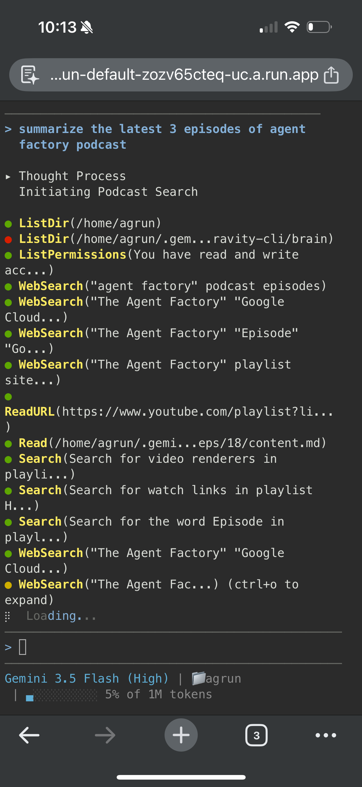
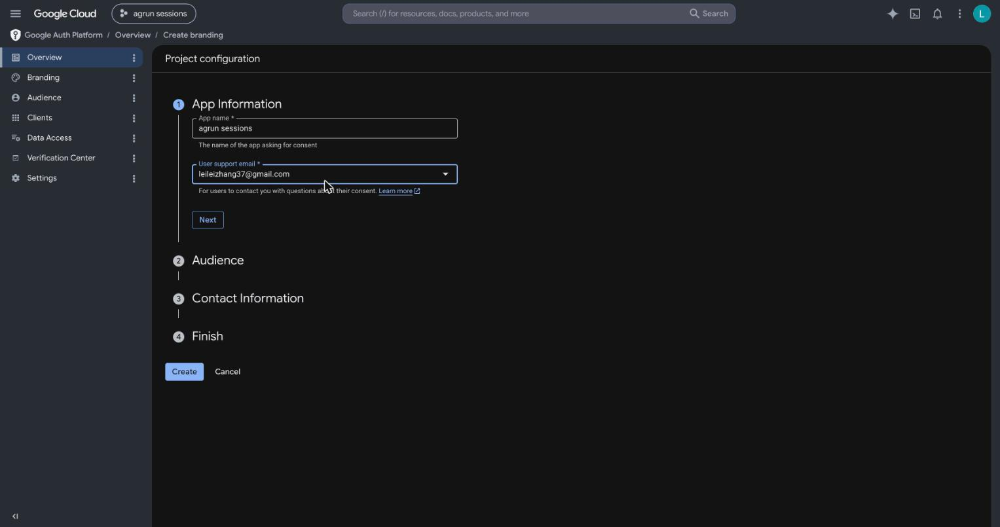
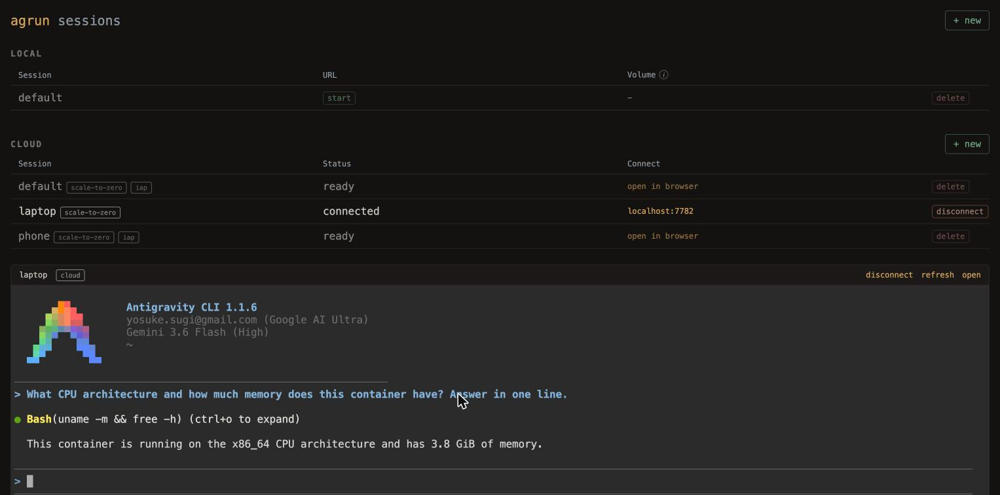

# How I drive a cloud coding agent from my phone through the browser

**tl;dr:** I put Google's Identity-Aware Proxy in front of a Cloud Run service
running a coding agent in a web terminal. Now I open a URL on my phone, sign in
with my Google account, and I'm talking to the agent.



**Source:** [github.com/ykdojo/antigravity-cloud-run](https://github.com/ykdojo/antigravity-cloud-run)

This builds on my [containerized dev environments
setup](ephemeral-dev-environments.md): the agent runs with
`--dangerously-skip-permissions` inside a container on Cloud Run, reachable
through a web terminal. The missing piece was using it away from my laptop.

## Two ways to reach a session from a phone, and why I picked IAP

My sessions already join my Tailscale network, so the obvious route was the
Tailscale app on the phone. It works, but there's a catch: tailnet traffic
bypasses Cloud Run's front end entirely, so the autoscaler thinks the service
is idle and reclaims the instance after about 15 minutes, mid-use. The only fix
is pinning the instance with min-instances=1, which costs money around the
clock whether I'm using it or not.

IAP flips that. Identity-Aware Proxy is Google Cloud's managed sign-in gate:
you put it in front of a service, and only the Google accounts you allowlist
get through. You open the service's regular `run.app` URL, sign in, and you're
at the terminal. The terminal's
WebSocket is a real ingress request, so opening the tab wakes the instance,
keeps it alive while you're connected, and lets it scale back to zero when you
close the tab.

If you want the instance to never die, deploy with min-instances=1 and it
never scales down to zero.

## The stack, layer by layer

- **IAP** decides who gets in. Only the Google accounts you allowlisted can
  access it.
- **ttyd** turns the browser into a terminal. The agent is a TUI and the
  browser speaks HTTP/WebSocket; ttyd bridges the two.
- **tmux** keeps the session alive when the connection drops, and you can
  attach to the same session from multiple devices.
- **agy** does the work.

## Setting it up

Enabling IAP on the service itself is three commands:

```
gcloud run services update SERVICE --region REGION --iap

gcloud run services add-iam-policy-binding SERVICE --region REGION \
  --member serviceAccount:service-PROJECT_NUMBER@gcp-sa-iap.iam.gserviceaccount.com \
  --role roles/run.invoker

gcloud beta iap web add-iam-policy-binding --resource-type=cloud-run \
  --service SERVICE --region REGION \
  --member user:YOU@gmail.com --role roles/iap.httpsResourceAccessor
```

If your project lives in a Google Cloud organization, you may be done. Mine
doesn't, and that's where the detour starts.

## The 502 detour: no organization, no automatic OAuth client

After enabling IAP, every request returned a 502 with this body:

```
Empty Google Account OAuth client ID(s)/secret(s).
```

The reason: IAP's Google-managed OAuth client only authenticates
users **inside your organization**. A personal project has no organization, so
there is no client at all, hence "empty". External users need a custom OAuth
client handed to IAP. Four steps, mostly console clicks:

1. **Branding** (console, Google Auth Platform → Overview → Get started): app
   name, support email, audience External, agree to the API user-data policy.

   
2. **Test users** (Audience page): while the consent screen is in Testing,
   only listed test users can sign in. Add every account you granted the
   accessor role to. Testing mode also expires sign-ins after about 7 days;
   publishing the app removes that if the weekly re-sign-in bothers you.
3. **Custom OAuth client** (Clients page): type Web application. Add this
   authorized redirect URI, with your new client's ID substituted in:
   `https://iap.googleapis.com/v1/oauth/clientIds/CLIENT_ID:handleRedirect`.
   Note that Google now shows the secret only at creation time, so grab it
   then.
4. **Hand the client to IAP**, at the project level so every IAP service in
   the project inherits it:

   ```
   # iap_settings.yaml
   access_settings:
     oauth_settings:
       client_id: CLIENT_ID
       client_secret: CLIENT_SECRET
   ```

   ```
   gcloud iap settings set iap_settings.yaml --project PROJECT
   ```

   Delete the yaml afterwards. IAP stores the secret as a hash.

The change takes effect in seconds: the same curl that returned 502 now
returns a 302 to accounts.google.com. On the phone: open
`https://SERVICE-URL/?fontSize=16` (ttyd accepts xterm options as query
parameters, and fontSize is the one that matters on mobile), pick your Google
account, and the terminal loads.

## What IAP breaks, and the dead end I hit trying to fix it

One thing stops working: `gcloud run services proxy`, which is how my
dashboard embeds cloud terminals locally. The proxy isn't a tunnel. It
forwards requests to the same public URL with an identity token attached, and
IAP rejects that token: it was minted for the service URL as audience, and IAP
wants its own OAuth client ID as the audience. User accounts can't mint that
kind of token with plain gcloud, so there's no flag that fixes it.

IAP has a setting for exactly this:
`programmatic_clients`, an allowlist of extra OAuth client IDs whose tokens
IAP will accept. Allowlisting gcloud's own client ID would have made the proxy
work unchanged. The API refused: the allowlisted client must be in the same
organization as the resource, and a no-org project can't satisfy that. If you
have an org, that's your escape hatch; without one, it's a dead end.

So it's a per-session choice, and I made it a flag. My deploy script takes
`-i` to bring a session up phone-ready (IAP plus the IAM grants), and the
dashboard reads the `run.googleapis.com/iap-enabled` annotation on each
service and renders accordingly: normal sessions get the embedded terminal
via the local proxy, IAP sessions get an "open in browser" link. Default is
no IAP, because the embedded local experience is still the main one.



## Cost

- IAP path: $0 idle, normal request-time billing while a tab is open.
- Tailscale fallback with a pinned instance: roughly $0.15/hr at 2 CPU / 2Gi,
  so about $110/month if you leave it pinned. That's the bill IAP avoids.

## What's next

Phone keyboards have no Esc, Ctrl, Tab, or arrow keys, and the agent's menus
want arrows. The plan is a small same-origin wrapper page that serves a key
toolbar above the terminal iframe. That needs the wrapper and ttyd on one
origin, so they'll share a port behind a tiny proxy inside the container.
